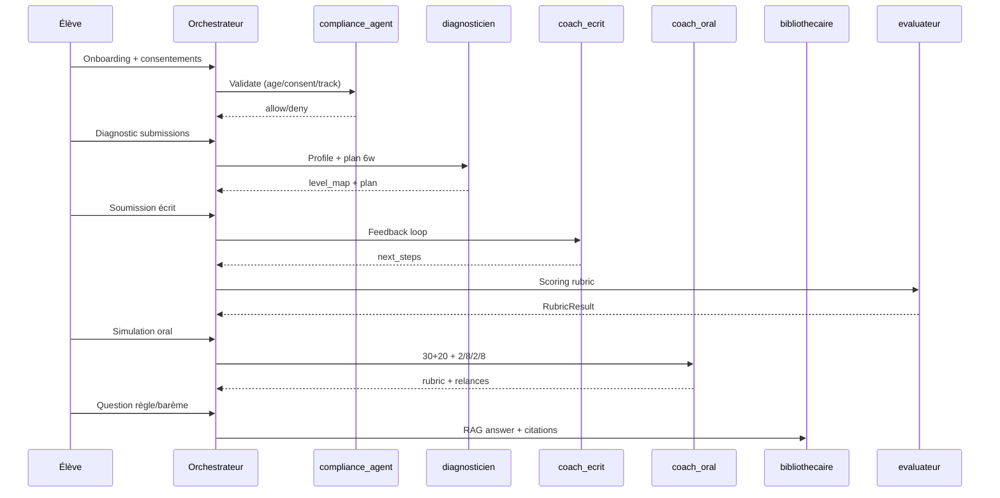
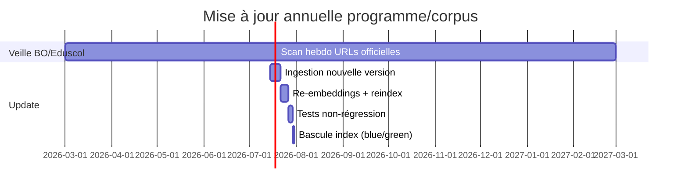

But : Décrire le pipeline RAG + orchestration agentique + QA/ops (MVP → prod).

## Ingestion (sources → chunks → index)
Sources (officiel d’abord) : éduscol EAF, programmes, BO œuvres, annales éduscol, CNIL, Eur‑Lex AI Act, Légifrance CPI/LIL, OWASP, NIST, arXiv RAG (Lewis et al. 2020).  
Règles chunking : structure (titres), 800–1200 tokens, overlap 80–120, conserver `page`, `section_path`, `quote_span`. Dédup : hash PDF + canonical_url ; version : `published_at` + `ingested_at`.

### Schéma metadata (minimum)
`{doc_id, canonical_url, source_org, authority_level(A-D), doc_type, published_at, ingested_at, year_scope, license, legal_basis, locale, page, section_path, hash}`

```mermaid
flowchart LR
  A[Fetch URLs] --> B[Normalize (PDF->text+pages)]
  B --> C[Chunking + metadata + legal_basis]
  C --> D[Dedup/version]
  D --> E[Embeddings]
  D --> F[Lexical index BM25]
  E --> G[(Vector DB)]
  F --> H[(Search index)]
  G --> I[Retriever+Reranker]
  H --> I
```

### Commandes/pseudo-scripts
```bash
# 1) Récupération (exemples)
mkdir -p corpus/raw corpus/normalized
curl -L "https://eduscol.education.fr/document/52932/download" -o corpus/raw/eaf_definition.pdf
curl -L "https://eur-lex.europa.eu/eli/reg/2024/1689/oj?locale=fr" -o corpus/raw/ai_act.html

# 2) Lancer ingestion
python -m antigravity.ingest --input corpus/raw --out corpus/normalized --year_scope 2025-2026
python -m antigravity.index  --normalized corpus/normalized --rebuild
```

```python
# 3) Snippet (LlamaIndex-like, pseudo)
from antigravity.rag import load_docs, chunk_docs, embed, upsert_pgvector, build_bm25
docs = load_docs("corpus/normalized")
chunks = chunk_docs(docs, size=1000, overlap=100)
vectors = embed(chunks, model_env="EMBEDDINGS_MODEL")
upsert_pgvector(vectors, db_url=os.environ["VECTOR_DB_URL"])
build_bm25(chunks, out_dir="index/bm25")
```

## Retrieval & reranking
- Query router : {normatif, méthode, exercice, œuvre}.  
- Filters : `authority_level<=B` pour claims d’épreuve ; `year_scope` obligatoire.  
- Rerank top‑50 → top‑8 ; génération uniquement à partir de top‑8 + citations.

## Orchestration (parcours)


## QA / sécurité / monitoring
- Tests RAG : RAGAS sur Q/A normatives + méthode (score seuil), + tests “citation obligatoire”. (RAGAS : https://arxiv.org/abs/2309.15217)  
- Red‑teaming : prompt injection (OWASP), data exfiltration, tool abuse ; blocage automatique + alertes.  
- Hallucination detection : si claim normatif sans citation → refuse (R-CITE-01).  
- Observabilité : métriques `citation_rate`, `deny_rate_rules`, `avg_latency`, `retrieval_hit@k`, `exam_mode_block_count`.  
- Backups : snapshot quotidien (vector+bm25+metadata), rollback “blue/green index”.  
- CI/CD : sur PR “corpus_updates/*” → run ingest dry‑run + tests non‑régression + publication index.


