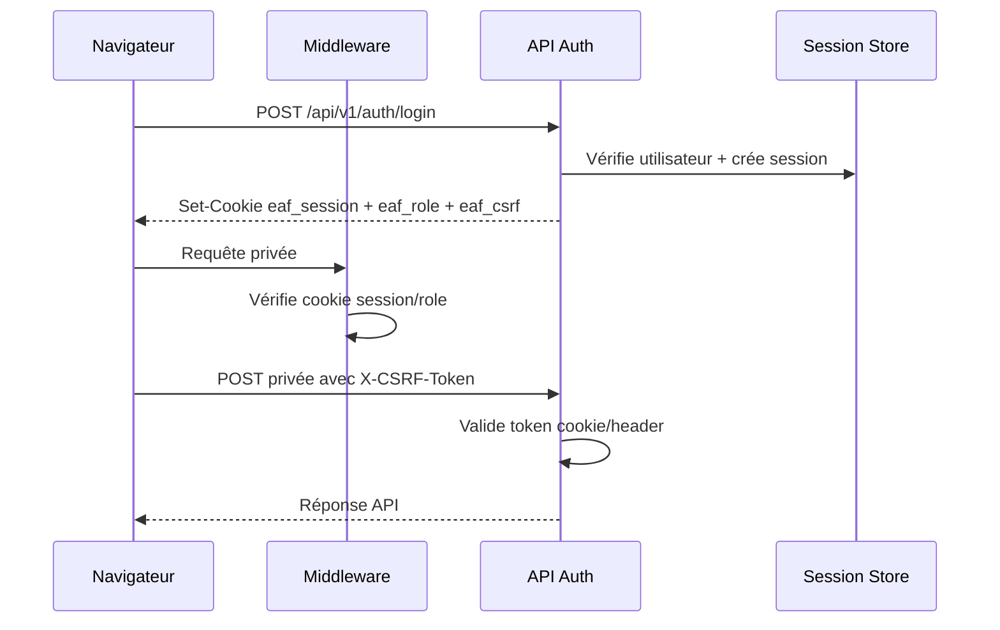
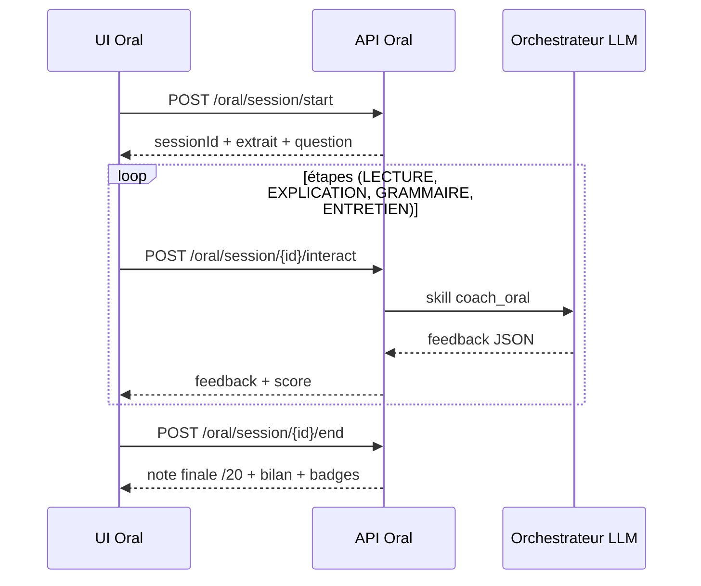

# Documentation complète du projet EAF Premium

Dernière mise à jour: 23 février 2026

## 1. Objectif produit
EAF Premium est une plateforme de préparation EAF (Première générale) combinant:
- entraînement écrit/oral/langue,
- recommandations personnalisées,
- bibliothèque documentaire structurée,
- tuteur IA appuyé par RAG,
- suivi enseignant de la progression de classe.

## 2. État fonctionnel actuel
## 2.1 Ce qui est en production applicative (dans le code)
- Auth complète (login/register/logout/me)
- Gestion session cookie + cookie de rôle
- Protection CSRF + rate-limit auth
- Validation Zod systématique sur les corps JSON
- Persistences:
  - Prisma/PostgreSQL (principal)
  - fallback JSON (`.data/memory-store.json`) maintenu
- RAG hybride:
  - vectoriel pgvector si disponible
  - lexical fallback sinon
- LLM multi-provider:
  - Gemini / OpenAI
  - orchestrateur par skills + parsing Zod + fallback structuré
- Atelier écrit:
  - génération sujet
  - upload copie
  - OCR + correction asynchrone
  - rapport PDF
- Atelier oral:
  - start/interact/end
  - STT/TTS côté navigateur
- Onboarding (3 étapes), parcours, quiz
- Gamification badges
- Espace enseignant
- Monitoring web vitals + logs structurés pino
- Tests unitaires + E2E

## 2.2 Limites connues actuelles
- `STORAGE_PROVIDER=s3` non implémenté (mode local uniquement)
- worker correction in-process (pas de queue externe)
- métriques Web Vitals stockées en mémoire (non persistées)
- espace parent minimal (page placeholder)

## 3. Stack technique
- Next.js 16.1.6 (App Router)
- React 19.2.3
- TypeScript strict
- Tailwind CSS 4
- Prisma 6 + PostgreSQL
- Recharts, react-markdown, rehype-highlight
- pino / pino-pretty
- Vitest + Playwright

## 4. Architecture
## 4.1 Organisation
- UI/pages: `src/app/*`
- API: `src/app/api/v1/*`
- Domain libs: `src/lib/*`
- Données de référence: `src/data/*`
- DB schema/migrations: `prisma/*`

## 4.2 Flux principal
1. Client authentifié -> API privées
2. Guard auth + middleware + CSRF
3. Services (`src/lib/*`)
4. Repos Prisma (fallback JSON selon disponibilité DB)
5. Réponse JSON/PDF/CSV

## 5. Modèle de données
Source unique: `prisma/schema.prisma`

## 5.1 Entités
- `User` (`role: eleve|enseignant|parent`)
- `Session`
- `MemoryEvent`
- `StudentProfile`
- `Evaluation`
- `EpreuveBlanche`
- `CopieDeposee`
- `OralSession`
- `Chunk` (embedding pgvector `vector(3072)`)

## 5.2 Migrations présentes
- `0001_init`
- `0002_student_profile_onboarding`
- `0003_profile_badges`

## 6. Sécurité
## 6.1 Sessions
- cookie `eaf_session` HTTP-only
- `secure` piloté par `COOKIE_SECURE`
- TTL session 14 jours

## 6.2 Contrôle d'accès
- middleware global (`middleware.ts`)
- routes publiques limitées
- garde rôle:
  - `/enseignant/*` réservé enseignant
  - `/parent/*` réservé parent

## 6.3 CSRF
- double-submit cookie `eaf_csrf` (non httpOnly)
- header attendu: `X-CSRF-Token`
- validation sur routes mutatives

## 6.4 Rate limiting
- login/register: 10 requêtes/min/IP
- en mémoire via Map TTL
- réponse 429 + `Retry-After`

## 7. LLM et RAG
## 7.1 Providers
- `src/lib/llm/provider.ts`: interface
- `src/lib/llm/adapters/gemini.ts`
- `src/lib/llm/adapters/openai.ts`
- `src/lib/llm/factory.ts`

## 7.2 Orchestrateur
- `src/lib/llm/orchestrator.ts`
- Prompt système: `src/lib/llm/prompts/system.ts`
- Skills:
  - `bibliothecaire`
  - `coach_ecrit`
  - `coach_oral`
  - `correcteur`
  - `quiz_maitre`
  - `tuteur_libre`
- Parsing Zod systématique + fallback JSON sûr

## 7.3 RAG
- Indexation: `src/lib/rag/indexer.ts`
- Recherche vectorielle: `src/lib/rag/vector-search.ts`
- Wrapper hybride: `src/lib/rag/search.ts`
- Script: `npm run rag:index`

## 8. Fonctionnalités par espace
## 8.1 Élève
- `/` dashboard dynamique
- `/atelier-ecrit`
- `/atelier-ecrit/correction/[copieId]`
- `/atelier-oral`
- `/atelier-langue`
- `/onboarding`
- `/mon-parcours`
- `/quiz`
- `/bibliotheque`
- `/tuteur`
- `/profil`

## 8.2 Enseignant
- `/enseignant`
- API classe/code/export/commentaire correction

## 8.3 Parent
- `/parent` (placeholder)

## 9. API
Référence complète endpoint par endpoint:
- `docs/API_REFERENCE.md`

## 10. Observabilité
## 10.1 Logs backend
- logger central: `src/lib/logger.ts`
- logs LLM: skill, modèle, tokens, latence, succès

## 10.2 Frontend vitals
- reporter: `src/components/monitoring/web-vitals-reporter.tsx`
- envoi: `src/lib/monitoring/web-vitals.ts`
- agrégation: `GET /api/v1/metrics/vitals`
- affichage santé: dashboard enseignant

## 11. Tests
## 11.1 Unitaires (Vitest)
- `tests/unit/langue-evaluation.test.ts`
- `tests/unit/rag-search.test.ts`
- `tests/unit/correcteur.test.ts`
- `tests/unit/vector-search.test.ts`
- `tests/unit/orchestrator.test.ts`

## 11.2 E2E (Playwright)
- `tests/e2e/platform.spec.ts`
- `tests/e2e/flows.spec.ts`
- fixture upload: `tests/fixtures/copie-test.png`

## 11.3 Commandes de validation
```bash
npx tsc --noEmit
npm run test:unit
npm run test:e2e
```

## 12. Variables d'environnement
Le fichier `.env.example` est la source de vérité actuelle et inclut:
- DB: `DATABASE_URL`, `DIRECT_URL`
- LLM: `LLM_PROVIDER`, `GEMINI_API_KEY`, `OPENAI_API_KEY`
- sécurité cookies: `COOKIE_SECURE`, `COOKIE_SECRET`
- storage: `STORAGE_PROVIDER`, `S3_*`, `MAX_UPLOAD_SIZE_MB`
- RAG: `RAG_CHUNK_SIZE`, `RAG_TOP_K`
- front app: `NEXT_PUBLIC_APP_NAME`, `NEXT_PUBLIC_APP_URL`

## 13. Scripts projet
- `dev`, `build`, `build:ci`, `start`
- `lint`
- `test`, `test:unit`, `test:e2e`
- `prisma:generate`, `prisma:migrate`
- `db:seed`
- `rag:index`

## 14. Fichiers structurants à connaître
- `middleware.ts`
- `prisma/schema.prisma`
- `src/lib/auth/*`
- `src/lib/db/*`
- `src/lib/llm/*`
- `src/lib/rag/*`
- `src/lib/epreuves/*`
- `src/lib/oral/*`
- `src/app/api/v1/*`

## 15. Dette technique documentée
- persistance/observabilité encore partiellement en mémoire (vitals, rate-limit)
- S3 absent
- parent space à enrichir
- certains contrats API historiques sans bloc JSDoc homogène

## 16. Inventaire exhaustif des pages
- `/`
- `/atelier-ecrit`
- `/atelier-ecrit/correction/[copieId]`
- `/atelier-langue`
- `/atelier-oral`
- `/bibliotheque`
- `/bienvenue`
- `/enseignant`
- `/login`
- `/mon-parcours`
- `/onboarding`
- `/parent`
- `/profil`
- `/quiz`
- `/tuteur`

## 17. Inventaire exhaustif des routes API v1
- `POST /api/v1/auth/login`
- `POST /api/v1/auth/logout`
- `GET /api/v1/auth/me`
- `POST /api/v1/auth/register`
- `POST /api/v1/badges/evaluate`
- `GET /api/v1/badges/list`
- `POST /api/v1/enseignant/class-code`
- `POST /api/v1/enseignant/corrections/{copieId}/comment`
- `GET /api/v1/enseignant/dashboard`
- `GET /api/v1/enseignant/export`
- `GET /api/v1/epreuves/{epreuveId}/copie/{copieId}`
- `POST /api/v1/epreuves/{epreuveId}/copie`
- `GET /api/v1/epreuves/copies/{copieId}/report`
- `POST /api/v1/epreuves/generate`
- `POST /api/v1/evaluations/langue`
- `GET /api/v1/health`
- `POST /api/v1/memory/events`
- `GET /api/v1/memory/timeline`
- `GET /api/v1/metrics/vitals`
- `POST /api/v1/onboarding/complete`
- `POST /api/v1/oral/session/{sessionId}/end`
- `POST /api/v1/oral/session/{sessionId}/interact`
- `POST /api/v1/oral/session/start`
- `POST /api/v1/parcours/generate`
- `POST /api/v1/quiz/generate`
- `POST /api/v1/rag/search`
- `GET /api/v1/student/profile`
- `PUT /api/v1/student/profile`
- `POST /api/v1/tuteur/message`

## 18. Diagrammes de flux (Mermaid)
## 18.1 Flux authentification + CSRF


## 18.2 Flux correction copie (écrit)
```mermaid
flowchart TD
  U[UI Atelier écrit] --> G[POST /epreuves/generate]
  U --> D[POST /epreuves/{id}/copie multipart]
  D --> R[(CopieDeposee status=pending)]
  D --> W[Worker in-process]
  W --> O[OCR Gemini]
  O --> C[Orchestrateur correcteur]
  C --> R2[(update status=done + correction JSON)]
  U --> P[Polling GET /epreuves/{id}/copie/{copieId}]
  P --> V[Affichage rapport]
  V --> PDF[GET /epreuves/copies/{copieId}/report]
```

## 18.3 Flux oral simulé

