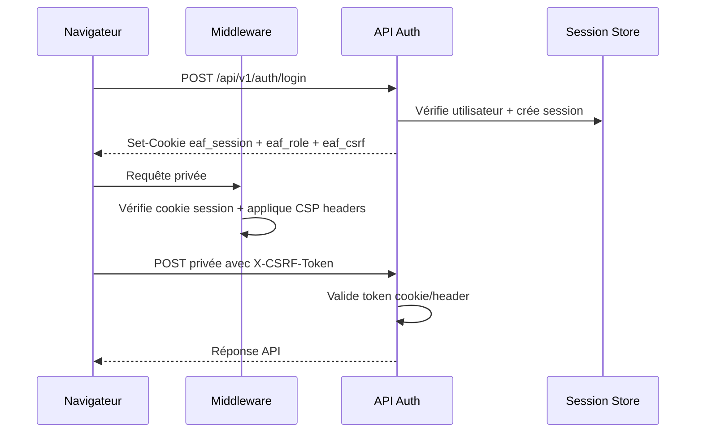
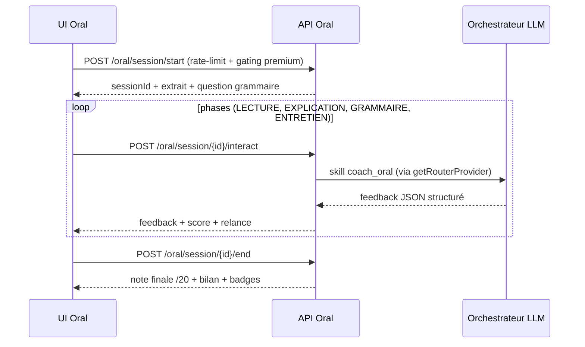

# Documentation complète du projet EAF Premium

Dernière mise à jour : 25 février 2026

## 1. Objectif produit
EAF Premium est une plateforme IA de préparation aux EAF (Première voie générale) combinant :
- entraînement écrit/oral/langue,
- recommandations personnalisées (skill map, parcours adaptatif),
- bibliothèque documentaire structurée + RAG,
- tuteur IA appuyé par citations,
- suivi enseignant de la progression de classe,
- gamification (badges, XP, streaks),
- billing/paiements (ClicToPay, plans FREE/PRO/MAX).

## 2. État fonctionnel actuel
## 2.1 Ce qui est en production

Production : **https://eaf.nexusreussite.academy** (VPS Ubuntu 22.04, PM2 `eaf-platform`, Nginx reverse proxy)

- Auth complète (login/register/logout/me) + rôles (`eleve`, `enseignant`, `parent`, `admin`)
- Gestion session cookie + cookie de rôle + toggle mot de passe sur login
- Protection CSRF double-submit + rate-limit auth
- CSP headers (`script-src 'self' 'unsafe-inline'`, HSTS 2 ans, X-Frame-Options DENY)
- Validation Zod systématique sur les corps JSON
- Persistances :
  - Prisma/PostgreSQL (principal, 8 migrations)
  - Fallback JSON (`.data/memory-store.json`) maintenu
- RAG hybride :
  - Vectoriel pgvector (`vector(768)`) si disponible
  - Lexical fallback sinon
- LLM multi-provider :
  - **Mistral AI** (routeur principal multi-tier : magistral-medium / mistral-small / ministral-8b / mistral-ocr)
  - Gemini / OpenAI (adaptateurs alternatifs)
  - Orchestrateur par skills + parsing Zod + fallback structuré
  - Coûts LLM tracés en Prisma (`LlmCostLog`) + alertes budget
- Atelier écrit : génération sujet, upload copie multipart (JPEG/PNG/WEBP/PDF, 20 Mo max), OCR Mistral (fallback Gemini), correction IA, rapport PDF, mise à jour SkillMap
- Atelier oral : sessions IA 4 phases (LECTURE/EXPLICATION/GRAMMAIRE/ENTRETIEN), STT/TTS navigateur, bilan /20, badges
- Atelier langue : exercices ciblés + feedback IA
- Onboarding diagnostique (3 étapes) + parcours personnalisé + quiz adaptatif
- Bibliothèque enrichie (50+ ressources) + tuteur IA avec citations RAG
- Espace enseignant (code classe, dashboard, distribution notes, export CSV, commentaires corrections)
- Gamification : badges, XP, niveaux, streaks, maxStreak
- Billing : plans (FREE/PRO/MAX/MONTHLY/LIFETIME), ClicToPay, quotas par feature, gating premium
- Notifications push (Web Push via VAPID) + emails (Resend) + crons (rapports hebdo, rappels révision)
- MCP Server (`packages/mcp-server`) : protocole MCP transport HTTP (port 3100)
- Monitoring : web vitals agrégés en Redis (TTL 24h), logs structurés pino, coûts LLM en Prisma
- Tests : 60+ fichiers unitaires Vitest + 2 fichiers E2E Playwright + tests MCP

## 2.2 Limites connues actuelles
- `STORAGE_PROVIDER=s3` non implémenté (stockage local `.data/uploads/...`)
- Espace parent minimal (page placeholder)

## 3. Stack technique
- **Next.js 16.1.6** (App Router, Turbopack), React 19.2.3, TypeScript strict
- **Tailwind CSS 4**, Recharts, Lucide React, react-markdown, rehype-highlight
- **Prisma 6** + PostgreSQL 15+ (+ `pgvector` pour RAG)
- **Redis 7+** (IoRedis) : rate-limiting, queues BullMQ, agrégation vitals
- **Mistral AI** (@mistralai/mistralai) : routeur LLM principal
- **Gemini** (@google/generative-ai) + **OpenAI** (openai) : adaptateurs alternatifs
- **pino** / pino-pretty : logs structurés
- **Resend** : emails transactionnels
- **web-push** : notifications push
- **node-cron** : scheduler cron
- **@react-pdf/renderer** : génération PDF
- **BullMQ** : queues de correction
- Vitest + Playwright : tests

## 4. Architecture
## 4.1 Organisation
- UI/pages : `src/app/*` (15 pages)
- API v1 : `src/app/api/v1/*` (30+ routes)
- API MCP : `src/app/api/mcp/*`
- Domain libs : `src/lib/*`
- Agents IA : `src/lib/agents/*`
- Données de référence : `src/data/*`
- DB schema/migrations : `prisma/*` (8 migrations)
- MCP Server : `packages/mcp-server/*`

## 4.2 Flux principal
1. Client → Middleware (CSP, auth, redirections)
2. API privées → Guard auth + CSRF
3. Services (`src/lib/*`) → Orchestrateur LLM / RAG
4. Repos Prisma (fallback JSON si DB indisponible)
5. Réponse JSON/PDF/CSV

## 5. Modèle de données
Source unique : `prisma/schema.prisma`

## 5.1 Entités principales
- `User` (`role: eleve|enseignant|parent|admin`)
- `Session`
- `MemoryEvent`
- `StudentProfile` (displayName, classLevel, targetScore, xp, level, streak, skillMap, voie, etc.)
- `Evaluation`
- `EpreuveBlanche`
- `CopieDeposee` (status: pending/processing/done/error)
- `OralSession` (status: DRAFT → FINALIZED, mode: SIMULATION/FREE_PRACTICE)
- `OralPhaseScore`, `OralTranscript`, `OralBilan`
- `OfficialWork` (œuvres versionnées par année scolaire)
- `Chunk` (embedding pgvector `vector(768)`)
- `LlmCostLog` (tracking coûts LLM par skill/provider/tier)
- `LlmBudgetAlert`
- `Subscription` (plan: FREE/PRO/MAX/MONTHLY/LIFETIME, status)
- `UsageCounter` (quotas par feature/période)
- `PaymentTransaction` (ClicToPay)
- `ErrorBankItem` (banque d'erreurs + révision espacée)
- `ComplianceLog` (audit conformité AI Act/RGPD)
- `PushSubscription` (Web Push)
- `SkillMapEntry` (compétences EAF avec spaced repetition)
- `WeakSkillEntry` (faiblesses détectées + sévérité)
- `WorkMastery` (maîtrise par œuvre)
- `MemorySummary` (résumés mémoire)
- `DocumentDeposit` (dépôts documents)
- `AgentInteraction` (interactions agents IA)

## 5.2 Migrations présentes
1. `0001_init`
2. `0002_student_profile_onboarding`
3. `0003_profile_badges`
4. `0004_rag_columns_and_missing_models`
5. `0005_oral_eaf_conformity`
6. `0006_oral_v2_schema`
7. `0007_billing_plans_v2`
8. `0008_addendum_memory_store_v1`

## 6. Sécurité
## 6.1 Sessions
- Cookie `eaf_session` HTTP-only
- `secure` piloté par `COOKIE_SECURE`
- TTL session 14 jours

## 6.2 Contrôle d'accès
- Middleware global (`middleware.ts`) avec security headers
- Routes publiques : `/login`, `/bienvenue`
- API publiques : `/api/v1/auth/login`, `/api/v1/auth/register`, `/api/v1/health`, `/api/v1/payments/clictopay/callback`
- Garde rôle : `/enseignant/*` réservé enseignant, `/parent/*` réservé parent

## 6.3 Headers de sécurité (CSP)
- `Content-Security-Policy` : `script-src 'self' 'unsafe-inline'`, `frame-ancestors 'none'`, etc.
- `Strict-Transport-Security` : max-age=63072000 (2 ans), includeSubDomains, preload
- `X-Frame-Options` : DENY
- `X-Content-Type-Options` : nosniff
- `Referrer-Policy` : strict-origin-when-cross-origin

## 6.4 CSRF
- Double-submit cookie `eaf_csrf` (non httpOnly)
- Header attendu : `X-CSRF-Token`
- Validation sur routes mutatives

## 6.5 Rate limiting
- Login : 10 req/min/IP
- Register : 3 req/heure/IP
- Tuteur : 30 msg/heure
- RAG : 20 req/min
- Oral : 3 sessions/heure
- Upload copie : 5/heure/élève
- Réponse 429 + `Retry-After`

## 7. LLM et RAG
## 7.1 Providers
- `src/lib/llm/provider.ts` : interface commune
- `src/lib/llm/adapters/mistral.ts` : Mistral AI (principal)
- `src/lib/llm/adapters/gemini.ts` : Google Gemini
- `src/lib/llm/adapters/openai.ts` : OpenAI
- `src/lib/llm/factory.ts` : factory par `LLM_PROVIDER`

## 7.2 Routeur Mistral multi-tier
- `src/lib/llm/router.ts` : routage par skill → tier → modèle
- **Tier 1 (reasoning)** : diagnosticien, correcteur, avocat_diable, self_reflection → magistral-medium
- **Tier 2 (standard)** : tuteur_libre, bibliothecaire, coach_oral, coach_ecrit, quiz_maitre, rapport_auto, langue → mistral-small
- **Tier 3 (micro)** : planner, student_modeler, rappel_agent → ministral-8b
- **OCR** : ocr_copie → mistral-ocr

## 7.3 Orchestrateur
- `src/lib/llm/orchestrator.ts` : orchestration via `getRouterProvider(skill, tokens)`
- `src/lib/llm/self-reflection.ts` : auto-évaluation réponses
- Parsing Zod systématique + fallback JSON sûr
- Cost tracking : `src/lib/llm/cost-tracker.ts` → Prisma `LlmCostLog` + budget alerts

## 7.4 RAG
- Indexation : `src/lib/rag/indexer.ts`
- Recherche vectorielle : `src/lib/rag/vector-search.ts`
- Wrapper hybride : `src/lib/rag/search.ts`
- Script : `npm run rag:index`

## 8. Fonctionnalités par espace
## 8.1 Élève
- `/` : dashboard dynamique (scores, signaux faibles, activité, streak)
- `/atelier-ecrit` + `/atelier-ecrit/correction/[copieId]`
- `/atelier-oral`
- `/atelier-langue`
- `/onboarding`
- `/mon-parcours`
- `/quiz`
- `/bibliotheque`
- `/tuteur`
- `/profil` (badges, XP, niveaux)
- `/pricing` (plans et paiement)
- `/bienvenue` (landing)

## 8.2 Enseignant
- `/enseignant` : dashboard classe, distribution notes, copies corrigées, export CSV, commentaires

## 8.3 Parent
- `/parent` (placeholder)

## 8.4 Paiement
- `/pricing` : choix du plan
- `/paiement/confirmation` : callback succès ClicToPay
- `/paiement/refus` : callback échec

## 9. API
Référence complète : `docs/API_REFERENCE.md`

## 10. Observabilité
## 10.1 Logs backend
- Logger central : `src/lib/logger.ts` (pino)
- Logs LLM : skill, modèle, tier, tokens input/output, latence, succès, coût

## 10.2 Frontend vitals
- Reporter : `src/components/monitoring/web-vitals-reporter.tsx`
- Envoi : `src/lib/monitoring/web-vitals.ts`
- Agrégation : `POST /api/v1/metrics/vitals` (stockage Redis TTL 24h)
- Lecture : `GET /api/v1/metrics/vitals` (admin only)

## 10.3 Coûts LLM
- Tracking : `src/lib/llm/cost-tracker.ts`
- Persistance : Prisma `LlmCostLog` (par skill, provider, tier, modèle)
- Alertes : `LlmBudgetAlert` si dépassement seuil

## 11. Tests
## 11.1 Unitaires (Vitest) — 60+ fichiers
Catégories :
- `tests/unit/agents/` : diagnosticien, diction-analyzer, examiner-persona, pastiche, planner, policy-gate, policy-gate-tunisia, rapport-auto, router-agent, shadow-timer, student-modeler
- `tests/unit/api/` : badges-route, class-code-route, comment-idor, copie-status-route, export-csv-route, memory-timeline-route, vitals-route
- `tests/unit/llm/` : cost-tracker, mistral-router, orchestrator, token-estimate
- `tests/unit/memory/` : context-builder, scoring
- `tests/unit/oral/` : scoring, state-machine
- `tests/unit/rag/` : chunker, rerank
- `tests/unit/security/` : clictopay-hmac, csrf, rate-limit
- `tests/unit/billing/` : quotas
- `tests/unit/compliance/` : anti-triche
- `tests/unit/gamification/` : badges
- `tests/unit/notifications/` : templates
- `tests/unit/spaced-repetition/` : sm2
- `tests/unit/skills/` : agent-schemas
- `tests/unit/store/` : premium-store
- `tests/unit/validation/` : request
- `tests/unit/parent/` : digest
- `tests/unit/portfolio/` : export
- `tests/unit/queue/` : correction-queue
- `tests/unit/rgpd/` : consent
- Racine : badges, billing-gating, correcteur, cost-tracker-v2, langue-evaluation, mcp-client, mistral-ocr, mistral-router-v2, oral-session, orchestrator, policy-gate-tunisia, rag-search, rappel-agent-mcp, spaced-repetition, upload-copie, vector-search

## 11.2 E2E (Playwright)
- `tests/e2e/platform.spec.ts`
- `tests/e2e/flows.spec.ts`

## 11.3 MCP Server
- `packages/mcp-server/tests/` : skill-delta, mcp-server

## 11.4 Commandes de validation
```bash
npm run typecheck          # tsc --noEmit
npm run test:unit          # Vitest
npm run test:e2e           # Playwright
npm run mcp:test           # Tests MCP
npm run test:all           # Unit + MCP
```

## 12. Variables d'environnement
Voir la table complète dans `README.md`. Variables critiques :
- DB : `DATABASE_URL`, `DIRECT_URL`
- Redis : `REDIS_URL`
- LLM : `MISTRAL_API_KEY`, `GEMINI_API_KEY`, `OPENAI_API_KEY`, `LLM_PROVIDER`, `LLM_ROUTER_ENABLED`
- Sécurité : `COOKIE_SECURE`, `SESSION_SECRET`, `CRON_SECRET`
- MCP : `MCP_API_KEY`
- Paiements : `CLICTOPAY_USERNAME`, `CLICTOPAY_PASSWORD`
- Notifications : `RESEND_API_KEY`, `VAPID_PUBLIC_KEY`, `VAPID_PRIVATE_KEY`
- Storage : `STORAGE_PROVIDER`, `MAX_UPLOAD_SIZE_MB`

## 13. Scripts projet
```
dev, build, build:ci, start, lint, typecheck
test, test:unit, test:e2e, test:all
prisma:generate, prisma:migrate, db:seed
rag:index, scheduler
mcp:dev, mcp:build, mcp:start, mcp:inspect, mcp:test, mcp:init
setup, ci:config-sanity
```

## 14. Fichiers structurants à connaître
- `middleware.ts` : auth + security headers + CSP
- `prisma/schema.prisma` : 25+ modèles
- `src/lib/auth/*` : session, guard, types
- `src/lib/db/*` : repositories, client
- `src/lib/llm/*` : providers, router, orchestrator, cost-tracker
- `src/lib/rag/*` : indexer, vector-search, search
- `src/lib/epreuves/*` : worker correction
- `src/lib/oral/*` : service oral
- `src/lib/billing/*` : gating, plans
- `src/lib/security/*` : csrf, rate-limit
- `src/lib/agents/*` : agents IA spécialisés
- `src/lib/cron/*` : scheduler
- `src/app/api/v1/*` : 30+ routes API
- `packages/mcp-server/*` : MCP Server

## 15. Dette technique documentée
- `STORAGE_PROVIDER=s3` non implémenté
- Espace parent à enrichir
- Certains contrats API historiques sans bloc JSDoc homogène

## 16. Inventaire exhaustif des pages
- `/`
- `/atelier-ecrit`
- `/atelier-ecrit/correction/[copieId]`
- `/atelier-langue`
- `/atelier-oral`
- `/bibliotheque`
- `/bienvenue`
- `/enseignant`
- `/login`
- `/mon-parcours`
- `/onboarding`
- `/paiement/confirmation`
- `/paiement/refus`
- `/parent`
- `/pricing`
- `/profil`
- `/quiz`
- `/tuteur`

## 17. Inventaire exhaustif des routes API
### v1 (`/api/v1/...`)
- `POST /auth/login`
- `POST /auth/logout`
- `GET /auth/me`
- `POST /auth/register`
- `POST /badges/evaluate`
- `GET /badges/list`
- `POST /cron/revision-reminders` (protégé CRON_SECRET)
- `POST /cron/weekly-reports` (protégé CRON_SECRET)
- `POST /enseignant/class-code`
- `POST /enseignant/corrections/{copieId}/comment`
- `GET /enseignant/dashboard`
- `GET /enseignant/export`
- `POST /epreuves/generate`
- `POST /epreuves/{epreuveId}/copie`
- `GET /epreuves/{epreuveId}/copie/{copieId}`
- `GET /epreuves/copies/{copieId}/report`
- `POST /evaluations/langue`
- `GET /health`
- `POST /memory/events`
- `GET /memory/timeline`
- `POST /metrics/vitals`
- `GET /metrics/vitals` (admin only)
- `POST /onboarding/complete`
- `POST /oral/session/start`
- `POST /oral/session/{sessionId}/interact`
- `POST /oral/session/{sessionId}/end`
- `POST /parcours/generate`
- `POST /payments/clictopay/callback`
- `POST /quiz/generate`
- `POST /rag/search`
- `GET /student/profile`
- `PUT /student/profile`
- `POST /tuteur/message`

### MCP (`/api/mcp/...`)
- `GET /health`

## 18. Diagrammes de flux (Mermaid)
## 18.1 Flux authentification + CSRF


## 18.2 Flux correction copie (écrit)
```mermaid
flowchart TD
  U[UI Atelier écrit] --> G[POST /epreuves/generate]
  U --> D[POST /epreuves/{id}/copie multipart]
  D --> V[Validation MIME + taille 20 Mo]
  V --> R[(CopieDeposee status=pending)]
  R --> W[Worker BullMQ]
  W --> O[OCR Mistral / fallback Gemini]
  O --> C[Orchestrateur correcteur]
  C --> SK[processInteraction → SkillMap update]
  SK --> R2[(status=done + correction JSON)]
  U --> P[Polling GET /epreuves/{id}/copie/{copieId}]
  P --> AF[Affichage rapport]
  AF --> PDF[GET /epreuves/copies/{copieId}/report]
```

## 18.3 Flux oral simulé

