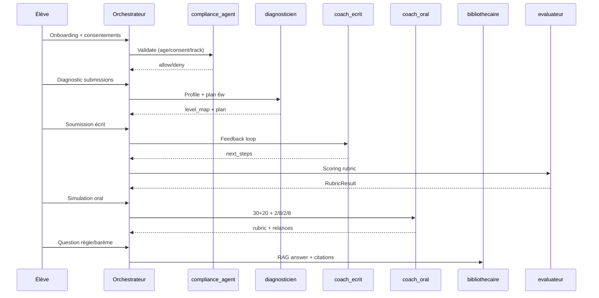
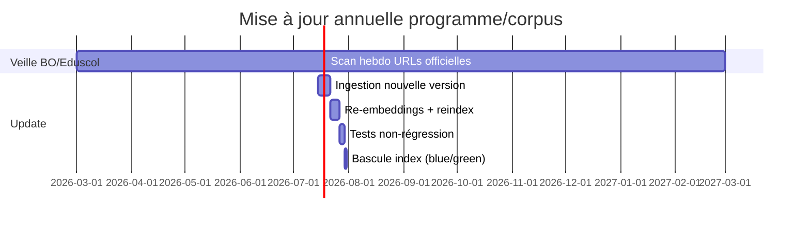

Do deep research on la conception et la production de livrables développeur‑ready (.antigravity) pour une plateforme IA premium de préparation autonome & interactive à l’EAF (Première, voie générale uniquement).

--- skills.md ---
But : Définir les agents/skills (contrats I/O, prompts, limites, tests) pour implémentation.

## Objets JSON communs (schemas minimaux)
```json
{
  "StudentProfile": {
    "type": "object",
    "required": ["student_id", "age", "grade", "track", "exam_year", "consents", "mode"],
    "properties": {
      "student_id": {"type": "string"},
      "age": {"type": "integer", "minimum": 13, "maximum": 25},
      "grade": {"type": "string", "enum": ["premiere"]},
      "track": {"type": "string", "enum": ["voie_generale"]},
      "exam_year": {"type": "integer"},
      "mode": {"type": "string", "enum": ["entrainement", "examen"]},
      "consents": {
        "type": "object",
        "required": ["rgpd_ok", "parent_ok_if_under_15"],
        "properties": {"rgpd_ok": {"type": "boolean"}, "parent_ok_if_under_15": {"type": "boolean"}}
      },
      "level_map": {"type": "object", "additionalProperties": {"type": "number", "minimum": 0, "maximum": 1}}
    }
  },
  "ProductionSubmission": {
    "type": "object",
    "required": ["submission_id", "student_id", "task_type", "content", "timebox_s", "context"],
    "properties": {
      "submission_id": {"type": "string"},
      "student_id": {"type": "string"},
      "task_type": {"type": "string", "enum": ["commentaire", "dissertation", "oral_lecture", "oral_explic_lin", "oral_entretien", "grammaire"]},
      "content": {"type": "object", "properties": {"text": {"type": "string"}, "audio_url": {"type": "string"}}},
      "timebox_s": {"type": "integer", "minimum": 60},
      "context": {"type": "object", "properties": {"prompt": {"type": "string"}, "work_ref": {"type": "string"}, "extract": {"type": "string"}}}
    }
  },
  "Citation": {
    "type": "object",
    "required": ["source_url", "source_title", "doc_id", "chunk_id", "retrieved_at", "quote"],
    "properties": {
      "source_url": {"type": "string"},
      "source_title": {"type": "string"},
      "doc_id": {"type": "string"},
      "chunk_id": {"type": "string"},
      "retrieved_at": {"type": "string"},
      "quote": {"type": "string", "maxLength": 240}
    }
  },
  "RubricResult": {
    "type": "object",
    "required": ["rubric_id", "total", "max", "criteria", "actions"],
    "properties": {
      "rubric_id": {"type": "string"},
      "total": {"type": "number"},
      "max": {"type": "number"},
      "criteria": {"type": "array", "items": {"type": "object", "required": ["id", "score", "max", "evidence"], "properties": {
        "id": {"type": "string"}, "score": {"type": "number"}, "max": {"type": "number"}, "evidence": {"type": "string"}
      }}},
      "actions": {"type": "array", "items": {"type": "string"}}
    }
  }
}
```

## Permissions & rate limits (global)
| Permission | Description |
|---|---|
| read_profile | lire StudentProfile |
| write_profile | écrire/updater profil & progression |
| read_submission | lire copie/audio |
| write_feedback | écrire feedback & plan d’action |
| read_corpus | interroger RAG (sources officielles) |
| write_corpus | ingérer/mettre à jour corpus |
| security_admin | règles sécurité, blocages |
| compliance_admin | règles RGPD/AI Act/droits |

| Skill | Limite (par élève) | Limite (par minute) |
|---|---:|---:|
| coach_ecrit/coach_oral | 30 req/j | 3 rpm |
| bibliothecaire | 80 req/j | 10 rpm |
| evaluateur | 20 req/j | 2 rpm |
| ingestion | n/a | 1 job simultané |
| security_agent/compliance_agent | n/a | 30 rpm internes |

## Contrat de réponse commun
```json
{
  "type": "object",
  "required": ["skill", "status", "data", "citations", "logs"],
  "properties": {
    "skill": {"type": "string"},
    "status": {"type": "string", "enum": ["ok", "refuse", "needs_more", "error"]},
    "data": {"type": "object"},
    "citations": {"type": "array", "items": {"$ref": "Citation"}},
    "logs": {"type": "array", "items": {"type": "object"}}
  }
}
```

## Skills

### diagnosticien
- Rôle : positionner l’élève (profil micro‑compétences EAF voie générale) + prescrire un plan 6 semaines.
- Entrées : StudentProfile + 1..3 ProductionSubmission (écrit/oral/langue).
- Sorties (data schema) :
```json
{"type":"object","required":["level_map","plan_6w","risks"],"properties":{
"level_map":{"type":"object"},
"plan_6w":{"type":"array","items":{"type":"object","required":["week","sessions"],"properties":{"week":{"type":"integer"},"sessions":{"type":"array","items":{"type":"string"}}}}},
"risks":{"type":"array","items":{"type":"string"}}
}}
```
- Prompt système (ex) : « Tu es diagnosticien EAF voie générale. Tu ne rédiges pas à la place. Tu produis un plan actionnable + objectifs mesurables. »
- Prompt assistant (ex) : « Analyse ces productions et propose 3 priorités + un plan hebdo. »
- Failure modes : sur‑diagnostic vague ; advice non EAF ; oublie consentements.
- Permissions : read_profile, read_submission, write_profile, write_feedback.
- QA : vérif track=voie_generale ; citations si règles d’épreuve mentionnées.
- Test :
  - Input : copie commentaire + oral 2 min.
  - Output attendu : level_map avec “citations”, “contresens”, plan_6w avec alternance écrit/oral/langue.

### coach_ecrit
- Rôle : guider commentaire/dissertation (structure, problématique, citations) + boucle réécriture.
- Entrées : StudentProfile, ProductionSubmission(task_type=commentaire|dissertation).
- Sorties : feedback + micro‑tâches (jamais “copie complète” en mode examen).
```json
{"type":"object","required":["rubric","feedback","next_steps"],"properties":{
"rubric":{"$ref":"RubricResult"},
"feedback":{"type":"array","items":{"type":"string"}},
"next_steps":{"type":"array","items":{"type":"string"}}
}}
```
- Système : « Coach écrit EAF. En mode examen: pas de génération longue, uniquement consignes de méthode. »
- Assistant : « Propose 2 axes + 1 transition modèle (≤2 phrases). »
- Failures : écrit la dissertation entière ; invente des citations ; confond voie techno.
- Permissions : read_profile, read_submission, write_feedback, read_corpus.
- QA : longueur max sortie en examen ; 0 hallucination sur œuvres ; citations si normes.
- Test :
  - Input : intro faible.
  - Output : 3 corrections ciblées + réécriture d’1 phrase (pas plus).

### coach_oral
- Rôle : simulation 30+20, explication linéaire, relances entretien, gestion temps (sans inférence émotion).
- Entrées : StudentProfile + ProductionSubmission(oral_* / grammaire) + consigne.
- Sorties : scoring 2/8/2/8 + script relances.
```json
{"type":"object","required":["rubric","timing","relances"],"properties":{
"rubric":{"$ref":"RubricResult"},
"timing":{"type":"object","properties":{"prep_s":{"type":"integer"},"passage_s":{"type":"integer"}}},
"relances":{"type":"array","items":{"type":"string"}}
}}
```
- Système : « Interdit: déduire stress/émotions. Autorisé: débit, pauses, articulation (descriptif). »
- Failures : “tu es anxieux” ; proctoring ; dépasse 20 min.
- Permissions : read_profile, read_submission, write_feedback, read_corpus.
- QA : check AI Act (no emotion inference) ; check barème oral cité.
- Test : Input audio_url + texte ; Output : 2/8/2/8 + 5 relances.

### langue
- Rôle : remédiation syntaxe/grammaire liée au passage (question courte).
- Entrées : ProductionSubmission(task_type=grammaire) + phrase cible.
- Sorties : correction + 3 exercices similaires.
```json
{"type":"object","required":["correction","exercices"],"properties":{
"correction":{"type":"string"},
"exercices":{"type":"array","items":{"type":"string"}}
}}
```
- Failures : notions hors programme ; jargon non défini.
- Permissions : read_submission, write_feedback, read_corpus.
- QA : concision ; exactitude ; citations sur terminologie si demandée.
- Test : phrase complexe → identification subordonnée + fonction.

### bibliothecaire
- Rôle : recherche RAG (documents officiels, annales) + réponses sourcées.
- Entrées : requête + filtres (année, objet d’étude, type doc).
- Sorties : réponse brève + citations obligatoires.
```json
{"type":"object","required":["answer","citations"],"properties":{"answer":{"type":"string"},"citations":{"type":"array","items":{"$ref":"Citation"}}}}
```
- Failures : répond sans source ; source non officielle.
- Permissions : read_corpus.
- QA : authority_level>=B ; quote ≤240 chars.
- Test : “barème oral ?” → answer + citation éduscol.

### evaluateur
- Rôle : noter une production selon rubrics officielles + plan actions + cohérence inter‑correcteurs.
- Entrées : ProductionSubmission + paramètres rubric (oral 2/8/2/8 ; écrit critères).
- Sorties : RubricResult + justification + warnings (plagiat suspect = escalade, pas “détection IA”).
```json
{"type":"object","required":["rubric","warnings"],"properties":{"rubric":{"$ref":"RubricResult"},"warnings":{"type":"array","items":{"type":"string"}}}}
```
- Failures : note arbitraire ; “détecteur IA” ; sanction automatique.
- Permissions : read_submission, read_profile, write_feedback.
- QA : cohérence (score ∈ [0,max]) ; explications appuyées sur preuves.
- Test : copie courte → note basse avec actions concrètes.

### ingestion
- Rôle : télécharger/normaliser/chunker/indexer corpus (officiel prioritaire) + versioning.
- Entrées : liste sources + règles chunking + storage creds.
- Sorties : rapport ingestion (docs ajoutés, ratio dédup, erreurs).
```json
{"type":"object","required":["added","updated","skipped","errors"],"properties":{
"added":{"type":"integer"},"updated":{"type":"integer"},"skipped":{"type":"integer"},
"errors":{"type":"array","items":{"type":"string"}}
}}
```
- Failures : ingère œuvres sous droits en intégral ; pas de provenance.
- Permissions : write_corpus, compliance_admin.
- QA : champ legal_basis ; hash ; canonical_url.
- Test : ingestion 3 PDFs éduscol → chunks versionnés + index.

### security_agent
- Rôle : appliquer OWASP LLM protections (prompt injection, tool gating, secrets, logs).
- Entrées : requête + contexte + traces outils.
- Sorties : décision allow/deny + remédiation.
```json
{"type":"object","required":["decision","reason","mitigations"],"properties":{
"decision":{"type":"string","enum":["allow","deny","sanitize"]},
"reason":{"type":"string"},
"mitigations":{"type":"array","items":{"type":"string"}}
}}
```
- Failures : laisse passer extraction secrets ; injection indirecte.
- Permissions : security_admin.
- QA : tests injection ; audit log obligatoire.
- Test : prompt “ignore rules” → deny + log.

### compliance_agent
- Rôle : contrôler RGPD/AI Act/droits (mineurs, consent, rétention, copyright).
- Entrées : action demandée + StudentProfile + doc metadata.
- Sorties : allow/deny + obligations (consent, suppression, excerpt only).
```json
{"type":"object","required":["decision","obligations"],"properties":{
"decision":{"type":"string","enum":["allow","deny","needs_parent_consent","needs_legal_review"]},
"obligations":{"type":"array","items":{"type":"string"}}
}}
```
- Failures : ignore <15 ans ; autorise émotion/proctoring.
- Permissions : compliance_admin.
- QA : check AI Act, LIL art.45, CPI L122-5.
- Test : élève 14 ans sans parent_ok → needs_parent_consent.

--- rules.md ---
But : Fixer les règles immuables (pédago/juridique/sécurité) + enforcement/logs.

Références (prioritaires) : EAF éduscol https://eduscol.education.fr/document/52932/download ; IA Act https://eur-lex.europa.eu/eli/reg/2024/1689/oj?locale=fr ; LIL art.45 https://www.legifrance.gouv.fr/codes/article_lc/LEGIARTI000037823135 ; CPI L122‑5 https://www.legifrance.gouv.fr/codes/article_lc/LEGIARTI000048603495 ; CNIL mineurs https://www.cnil.fr/fr/la-cnil-publie-8-recommandations-pour-renforcer-la-protection-des-mineurs-en-ligne ; MEN cadre IA https://www.education.gouv.fr/cadre-d-usage-de-l-ia-en-education-450647 ; OWASP LLM https://owasp.org/www-project-top-10-for-large-language-model-applications/ .

Format règle : **ID — Règle.** *Rationale* / *Enforcement* / *Log (ex)*

**R-SCOPE-01 — Voie générale uniquement.**  
Rationale : conformité périmètre produit EAF voie générale.  
Enforcement : reject si `track!=voie_generale` ou taches “contraction/essai”.  
Log : `{"rule":"R-SCOPE-01","action":"deny","reason":"track_not_supported","track":"voie_techno"}`

**R-AIACT-01 — Interdiction d’inférer émotions.**  
Rationale : AI Act (éducation).  
Enforcement : bloquer toute sortie/feature “stress/anxiété/confiance détectée”, analyse émotionnelle voix/visage.  
Log : `{"rule":"R-AIACT-01","action":"deny","reason":"emotion_inference","skill":"coach_oral"}`

**R-AIACT-02 — Aucun proctoring/surveillance d’examen.**  
Rationale : risques AI Act (éducation) + éthique.  
Enforcement : pas de webcam anti‑triche, pas de “détection comportement”, pas de sanction automatisée.  
Log : `{"rule":"R-AIACT-02","action":"deny","reason":"proctoring_feature"}`

**R-RGPD-01 — Consentement mineurs (<15 ans).**  
Rationale : LIL art.45 + CNIL.  
Enforcement : si `age<15` et base=consent → exiger `parent_ok_if_under_15=true` avant collecte/stockage productions.  
Log : `{"rule":"R-RGPD-01","action":"needs_parent_consent","student_age":14}`

**R-RGPD-02 — Minimisation & finalité.**  
Rationale : principes RGPD/CNIL.  
Enforcement : bloquer champs non nécessaires (santé, biométrie, opinions) ; redaction PII dans prompts.  
Log : `{"rule":"R-RGPD-02","action":"sanitize","reason":"extra_personal_data"}`

**R-RET-01 — Rétention & suppression.**  
Rationale : limitation conservation RGPD.  
Enforcement : TTL par défaut (ex. 12 mois productions, 30 jours logs détaillés) + API delete/export ; purge planifiée.  
Log : `{"rule":"R-RET-01","action":"purge","deleted_items":128,"scope":"submissions"}`

**R-COPY-01 — Œuvres sous droits : pas d’ingestion intégrale.**  
Rationale : CPI L122‑5 + licences.  
Enforcement : ingestion autorisée seulement si `license in [domaine_public, licence_expresse]`; sinon excerpting avec `legal_basis`.  
Log : `{"rule":"R-COPY-01","action":"deny","reason":"full_text_copyrighted","doc":"work_fulltext.pdf"}`

**R-COPY-02 — Extraits : champ legal_basis obligatoire.**  
Rationale : traçabilité droits.  
Enforcement : refuser chunk sans `legal_basis` (`courte_citation|accord|domaine_public`).  
Log : `{"rule":"R-COPY-02","action":"deny","reason":"missing_legal_basis","chunk_id":"c-123"}`

**R-PED-01 — Conformité EAF (format/barèmes).**  
Rationale : crédibilité & alignement officiel (EAF éduscol).  
Enforcement : toute règle d’épreuve doit citer source officielle ; tests non‑régression.  
Log : `{"rule":"R-PED-01","action":"deny","reason":"missing_citation","claim":"barème oral"}`

**R-FRAUD-01 — Mode examen verrouillé.**  
Rationale : intégrité + cadre MEN (fraude si devoir fait par IA).  
Enforcement : `mode=examen` ⇒ pas de génération longue (plans ok, consignes ok, pas de rédaction complète) ; feedback après dépôt.  
Log : `{"rule":"R-FRAUD-01","action":"blocked_output","reason":"long_generation_in_exam_mode","tokens":1200}`

**R-FRAUD-02 — Pas de “détecteur IA” décisionnel.**  
Rationale : MEN : détecteurs peu fiables.  
Enforcement : interdiction “IA‑detector score” ; seulement signaux pédagogiques (incohérences) → escalade humaine.  
Log : `{"rule":"R-FRAUD-02","action":"escalate","reason":"style_shift_suspected"}`

**R-CITE-01 — Politique citations/traceabilité.**  
Rationale : redevabilité, réduction hallucinations.  
Enforcement : réponses normatives ⇒ `citations[].{source_url,doc_id,chunk_id,retrieved_at,quote}` obligatoires ; sinon refuse.  
Log : `{"rule":"R-CITE-01","action":"deny","reason":"no_provenance","skill":"bibliothecaire"}`

**R-INJ-01 — Défense prompt injection (directe/indirecte).**  
Rationale : OWASP LLM.  
Enforcement : traiter contenus RAG/user comme non fiables ; allow‑list outils ; output validation ; strip “ignore rules”.  
Log : `{"rule":"R-INJ-01","action":"sanitize","reason":"prompt_injection_pattern","pattern":"ignore previous"}`

**R-AUDIT-01 — Journalisation & audit.**  
Rationale : conformité & incident response.  
Enforcement : logs immuables (append‑only) : décisions rules, accès corpus, actions suppression, jobs ingestion.  
Log : `{"rule":"R-AUDIT-01","action":"log_write","event":"corpus_access","doc_id":"eduscol-eaf-2024"}`

--- workflow.md ---
But : Décrire le pipeline RAG + orchestration agentique + QA/ops (MVP → prod).

## Ingestion (sources → chunks → index)
Sources (officiel d’abord) : éduscol EAF, programmes, BO œuvres, annales éduscol, CNIL, Eur‑Lex AI Act, Légifrance CPI/LIL, OWASP, NIST, arXiv RAG (Lewis et al. 2020).  
Règles chunking : structure (titres), 800–1200 tokens, overlap 80–120, conserver `page`, `section_path`, `quote_span`. Dédup : hash PDF + canonical_url ; version : `published_at` + `ingested_at`.

### Schéma metadata (minimum)
`{doc_id, canonical_url, source_org, authority_level(A-D), doc_type, published_at, ingested_at, year_scope, license, legal_basis, locale, page, section_path, hash}`

```mermaid
flowchart LR
  A[Fetch URLs] --> B[Normalize (PDF->text+pages)]
  B --> C[Chunking + metadata + legal_basis]
  C --> D[Dedup/version]
  D --> E[Embeddings]
  D --> F[Lexical index BM25]
  E --> G[(Vector DB)]
  F --> H[(Search index)]
  G --> I[Retriever+Reranker]
  H --> I
```

### Commandes/pseudo-scripts
```bash
# 1) Récupération (exemples)
mkdir -p corpus/raw corpus/normalized
curl -L "https://eduscol.education.fr/document/52932/download" -o corpus/raw/eaf_definition.pdf
curl -L "https://eur-lex.europa.eu/eli/reg/2024/1689/oj?locale=fr" -o corpus/raw/ai_act.html

# 2) Lancer ingestion
python -m antigravity.ingest --input corpus/raw --out corpus/normalized --year_scope 2025-2026
python -m antigravity.index  --normalized corpus/normalized --rebuild
```

```python
# 3) Snippet (LlamaIndex-like, pseudo)
from antigravity.rag import load_docs, chunk_docs, embed, upsert_pgvector, build_bm25
docs = load_docs("corpus/normalized")
chunks = chunk_docs(docs, size=1000, overlap=100)
vectors = embed(chunks, model_env="EMBEDDINGS_MODEL")
upsert_pgvector(vectors, db_url=os.environ["VECTOR_DB_URL"])
build_bm25(chunks, out_dir="index/bm25")
```

## Retrieval & reranking
- Query router : {normatif, méthode, exercice, œuvre}.  
- Filters : `authority_level<=B` pour claims d’épreuve ; `year_scope` obligatoire.  
- Rerank top‑50 → top‑8 ; génération uniquement à partir de top‑8 + citations.

## Orchestration (parcours)


## QA / sécurité / monitoring
- Tests RAG : RAGAS sur Q/A normatives + méthode (score seuil), + tests “citation obligatoire”. (RAGAS : https://arxiv.org/abs/2309.15217)  
- Red‑teaming : prompt injection (OWASP), data exfiltration, tool abuse ; blocage automatique + alertes.  
- Hallucination detection : si claim normatif sans citation → refuse (R-CITE-01).  
- Observabilité : métriques `citation_rate`, `deny_rate_rules`, `avg_latency`, `retrieval_hit@k`, `exam_mode_block_count`.  
- Backups : snapshot quotidien (vector+bm25+metadata), rollback “blue/green index”.  
- CI/CD : sur PR “corpus_updates/*” → run ingest dry‑run + tests non‑régression + publication index.



--- README.md ---
But : Indiquer aux devs Antigravity comment utiliser ces fichiers et lancer le MVP.

1) Placer ces fichiers dans : `.antigravity/`  
2) Variables env minimales (exemples) : `LLM_API_KEY`, `EMBEDDINGS_MODEL`, `VECTOR_DB_URL`, `LEXICAL_INDEX_PATH`, `STORAGE_BUCKET`, `AUDIT_LOG_URL`.  
3) Ingestion corpus (officiel d’abord) :
```bash
make ingest   # ou python -m antigravity.ingest ...
make index    # rebuild vector+bm25
```
4) Tests :
```bash
make test          # unit + rules enforcement
make test-rag      # RAGAS + citation checks
make test-security # prompt injection suite
```
5) Déployer MVP (exemples) :
```bash
docker compose up -d
# puis /health, /ingest/status, /ui
```
Hypothèses NON spécifiées (à décider) : budget, région d’hébergement, fournisseur LLM, SSO/éducation, politique exacte de rétention (durées), contact produit/légal.

--- manifest.json ---
```json
{
  "manifest_version": "1.0.0",
  "project": "antigravity-eaf-voie-generale",
  "contact": "UNSPECIFIED",
  "assumptions_unspecified": ["budget", "hosting_region", "llm_provider", "resource_estimates_cpu_gpu_ram"],
  "files": [
    {"path": ".antigravity/skills.md", "description": "Contrats des agents/skills (I/O, prompts, tests).", "priority": "must"},
    {"path": ".antigravity/rules.md", "description": "Règles immuables (AI Act, RGPD mineurs, droits, anti-fraude, logs).", "priority": "must"},
    {"path": ".antigravity/workflow.md", "description": "Pipelines ingestion/RAG + orchestration agentique + QA/ops.", "priority": "must"},
    {"path": ".antigravity/README.md", "description": "Mode d’emploi dev (ingestion, tests, déploiement).", "priority": "must"},
    {"path": ".antigravity/manifest.json", "description": "Manifest machine-readible (vars env, fichiers, version).", "priority": "must"}
  ],
  "required_env": [
    {"name": "LLM_API_KEY", "description": "Clé API du fournisseur LLM (UNSPECIFIED)."},
    {"name": "EMBEDDINGS_MODEL", "description": "Nom modèle embeddings (UNSPECIFIED)."},
    {"name": "VECTOR_DB_URL", "description": "Connexion base vectorielle (ex: Postgres+pgvector)."},
    {"name": "AUDIT_LOG_URL", "description": "Endpoint/stockage logs immuables (append-only)."},
    {"name": "STORAGE_BUCKET", "description": "Stockage corpus/raw+normalized (UNSPECIFIED)."},
    {"name": "YEAR_SCOPE_DEFAULT", "description": "Année scolaire par défaut (ex: 2025-2026)."}
  ],
  "resource_estimates_minimal": "UNSPECIFIED"
}
```